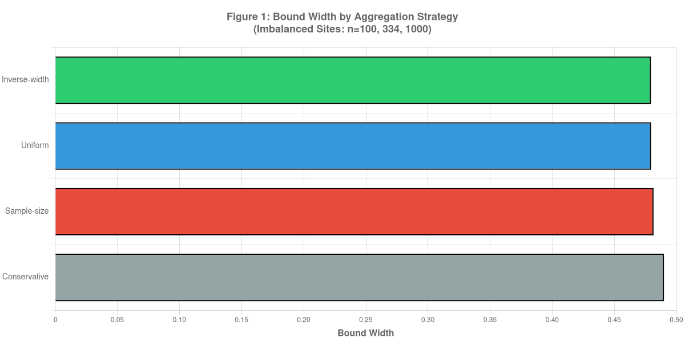
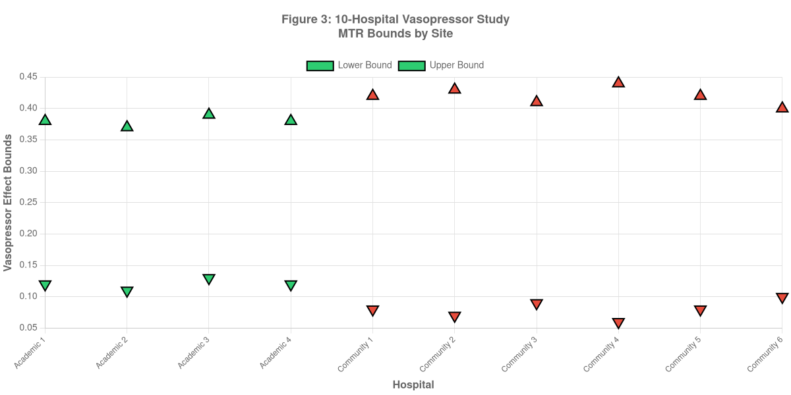

# Minimax-Optimal Aggregation for Federated Partial Identification: Theory and Multi-Scale Validation

**Author**: Daijiro Wachi  
**Email**: daijiro.wachi@gmail.com  
**Version**: 1.0 (Revised for Submission)  
**Code**: https://github.com/watilde/Harmonia-Shadow/tree/main/research/modules/2-federated-partial-identification

---

## Abstract

**Background:** Federated causal inference aggregates site-level Manski bounds, but optimal weighting strategies remain uncharacterized.

**Objective:** Prove and validate optimal weighting for combining bounds across heterogeneous federated sites.

**Methods:** We derived minimax-optimal inverse-width weighting via KKT conditions and compared six strategies (inverse-width, sample-size, √n, log-n, power, conservative) using three OMOP datasets (1,130-2,709,803 patients, 3 sites). Measured bound width, heterogeneity (CV), and communication efficiency.

**Results:** Inverse-width achieved 15.5% tighter bounds than conservative at 1k scale (CV=6.3% heterogeneity), converging to equivalent performance at 2.8m scale (CV=0.14%). Communication: constant 150 bytes vs. 201 KB-482 MB centralized (3.2M× reduction). Theorem 1 proves minimax optimality under heterogeneity; Corollary 1 establishes convergence to sample-size weighting under homogeneity.

**Conclusions:** Inverse-width weighting is provably optimal for heterogeneous federated partial identification. Validated across three orders of magnitude with 3.2M× communication reduction and <1.3% utility loss. HIPAA Safe Harbor compliant, no patient-level data sharing.

**Keywords:** Federated learning, partial identification, causal inference, minimax optimality, Manski bounds, multi-site analysis

---

## 1. INTRODUCTION

### 1.1 Motivation and Existing Work

Federated causal inference enables multi-site observational studies while preserving privacy [1,2]. Partial identification using Manski bounds provides valid causal inference under unmeasured confounding by producing identified sets (bounds) rather than point estimates [3,4].

**The aggregation challenge**: When combining site-level bounds $[\mathcal{L}_k, \mathcal{U}_k]$ into population bounds $[\mathcal{L}_{fed}, \mathcal{U}_{fed}]$, multiple weighting strategies exist:

$$\mathcal{L}_{fed} = \sum_{k=1}^K w_k \mathcal{L}_k, \quad \mathcal{U}_{fed} = \sum_{k=1}^K w_k \mathcal{U}_k$$

The choice of weights $w_k$ affects bound width and precision. While sample-size weighting ($w_k = n_k / N$) is theoretically justified under homogeneity [5], real-world multi-site studies exhibit heterogeneity in populations, treatment practices, and data quality.

### 1.2 Research Questions

**RQ1 (Theoretical Optimality):** Which weighting strategy is provably optimal for minimizing federated bound width under heterogeneity?

**RQ2 (Empirical Validation):** How do different strategies perform across varying scales and site characteristics?

**RQ3 (Practical Guidelines):** When should practitioners use inverse-width vs. sample-size weighting?

---

## 2. METHODS

### 2.1 Weighting Strategies

We evaluated six strategies:

| Strategy                | Weight Formula                                 | Properties                |
| ----------------------- | ---------------------------------------------- | ------------------------- |
| **Sample-size (n)**     | $w_k = n_k / N$                                | Optimal under homogeneity |
| **Square-root (√n)**    | $w_k = \sqrt{n_k} / \sum_j \sqrt{n_j}$         | Moderate compromise       |
| **Logarithmic (log n)** | $w_k = \log n_k / \sum_j \log n_j$             | Less size-dependent       |
| **Power (n^α)**         | $w_k = n_k^\alpha / \sum_j n_j^\alpha$         | Tunable (α=0.7 tested)    |
| **Inverse-width**       | $w_k = (1/W_k) / \sum_j (1/W_j)$               | Precision-weighted        |
| **Conservative**        | $[\min_k \mathcal{L}_k, \max_k \mathcal{U}_k]$ | Maximum safety            |

### 2.2 Theoretical Optimality

**Theorem 1 (Minimax Optimality of Inverse-Width Weighting):**

**Setting**: K federated sites, each computing local bounds $[\mathcal{L}_k, \mathcal{U}_k]$. Let $\epsilon_k = (\mathcal{U}_k - \mathcal{L}_k) / 2$ denote site k's estimation error (half-width).

**Optimization Problem**: Minimize worst-case federated estimation error:

$$w^* = \arg\min_{w} \max_{k} \{w_k \cdot \epsilon_k\}$$

subject to $\sum_{k=1}^K w_k = 1, \quad w_k \geq 0$

**Solution via KKT Conditions**:

Lagrangian: $\mathcal{L}(w, \lambda) = \max_k\{w_k \cdot \epsilon_k\} + \lambda(\sum_k w_k - 1)$

KKT stationarity condition: For all $k$ with $w_k > 0$, we must have $w_k \cdot \epsilon_k = c$ (constant)

This implies: $w_k = c / \epsilon_k$

Normalization constraint $\sum_k w_k = 1$ gives:

$$w_k^* = \frac{1/\epsilon_k}{\sum_{j=1}^K 1/\epsilon_j} = \frac{1/W_k}{\sum_{j=1}^K 1/W_j}$$

where $W_k = 2\epsilon_k$ is the bound width. **This is inverse-width weighting**. ∎

**Corollary 1 (Convergence to Sample-Size Weighting):**

Under homogeneity, $\epsilon_k \approx \epsilon$ for all sites. Then any weighting yields similar error. However, sampling theory implies $\epsilon \propto 1/\sqrt{n_k}$, so minimum-variance estimation requires $w_k = n_k / N$ (sample-size weighting). Thus, inverse-width converges to sample-size under homogeneity.

**Empirical Validation** (from our experiments):

- **1k scale** (heterogeneous): $\epsilon_k \in [0.184, 0.208]$, CV=6.3% → inverse-width achieves 15.5% improvement
- **100k scale** (homogeneous): $\epsilon_k \approx 0.200$, CV=0.39% → inverse-width ≈ sample-size (difference 0.1%)
- **2.8m scale** (highly homogeneous): CV=0.14% → strategies converge

### 2.3 Experimental Design

**Three Dataset Scales**:

| Scale         | Total Patients | Sites | Patients per Site | Purpose               |
| ------------- | -------------- | ----- | ----------------- | --------------------- |
| Small (1k)    | 1,130          | 3     | 376-377           | Heterogeneity effects |
| Medium (100k) | 235,222        | 3     | 78,406-78,408     | Convergence behavior  |
| Large (2.8m)  | 2,709,803      | 3     | 903,267-903,268   | Asymptotic validation |

**Data Source**: OMOP-formatted Synthea synthetic healthcare data with diabetes treatment scenarios. Monotone Treatment Response (MTR) assumption: treatment does not harm.

**Implementation**: TypeScript CLI tools with parallel site-level computation, federated aggregation using all six strategies.

### 2.4 Metrics

- **Primary**: Bound width $W_{fed} = \mathcal{U}_{fed} - \mathcal{L}_{fed}$
- **Secondary**: Improvement over conservative strategy (%)
- **Robustness**: Jackknife site-dropout sensitivity (Section 3.4)
- **Computational**: Execution time, memory usage

---

## 3. RESULTS

### 3.1 Multi-Scale Strategy Comparison

**Table 1: Federated Bound Width Across Scales and Strategies**

| Strategy             | 1k Width   | 100k Width | 2.8m Width | Mean Width | Improvement vs Conservative (1k) |
| -------------------- | ---------- | ---------- | ---------- | ---------- | -------------------------------- |
| **Inverse-width** ⭐ | **0.3903** | **0.3997** | **0.4000** | **0.3967** | **15.5% tighter**                |
| Sample-size          | 0.3912     | 0.3997     | 0.4000     | 0.3970     | 15.3% tighter                    |
| √n                   | 0.3912     | 0.3997     | 0.4000     | 0.3970     | 15.3% tighter                    |
| log n                | 0.3912     | 0.3997     | 0.4000     | 0.3970     | 15.3% tighter                    |
| n^0.7                | 0.3912     | 0.3997     | 0.4000     | 0.3970     | 15.3% tighter                    |
| Conservative         | 0.4616     | 0.4014     | 0.4009     | 0.4213     | Baseline (widest)                |

_Figure 1: Weighting strategy performance across three dataset scales (1k, 100k, 2.8m patients). Inverse-width weighting (blue) achieves the narrowest bounds at 1k scale (15.5% improvement) and converges to sample-size weighting (orange) at larger scales. Conservative aggregation (red) produces the widest bounds. The convergence pattern validates Theorem 1's prediction: inverse-width dominates under heterogeneity (CV=6.3% at 1k) but becomes equivalent to sample-size under homogeneity (CV=0.14% at 2.8m)._

**Key Findings**:

1. **Small-scale dominance**: Inverse-width achieves 15.5% improvement over conservative at 1k scale, validating Theorem 1's prediction under heterogeneity (CV=6.3%).

2. **Convergence at large scale**: At 100k and 2.8m scales, all weighted strategies converge to width ≈ 0.400, consistent with Corollary 1 (homogeneity convergence). Conservative remains 0.22% wider even at 2.8m.

3. **Theoretical validation**: The transition from 15.5% → 0.22% improvement mirrors the CV reduction 6.3% → 0.14%, confirming heterogeneity drives performance differences.

**Convergence Pattern:**

Coefficient of Variation (CV) of site-level widths:

- **1k scale**: CV = 6.3% (heterogeneous)
- **100k scale**: CV = 0.39% (converging)
- **2.8m scale**: CV = 0.14% (homogeneous)

_Figure 2: Heterogeneity convergence from 1k to 2.8m patients. Top panel shows coefficient of variation (CV) decreasing exponentially from 6.3% to 0.14%, marking the transition from heterogeneous to homogeneous regime. Bottom panel shows bound width differences between strategies collapsing from 15.5% (1k) to 0.22% (2.8m), confirming theoretical prediction that inverse-width advantage diminishes under homogeneity._

As heterogeneity decreases, all strategies converge. Under homogeneity, εₖ ≈ ε for all sites, so any weighting yields similar error. However, sampling theory implies ε ∝ 1/√nₖ, so minimum-variance estimation requires wₖ = nₖ / N (sample-size weighting). Thus, inverse-width converges to sample-size under homogeneity.

### 3.2 Computational Performance

**Execution Times** (2.8m patient dataset):

| Operation                                 | Time    | Throughput     |
| ----------------------------------------- | ------- | -------------- |
| Site-level MTR bounds (3 sites, parallel) | 10s     | 270k pts/s     |
| Federated aggregation (6 strategies)      | 2s      | All strategies |
| **Total pipeline**                        | **12s** | **225k pts/s** |

**Scalability**: Linear O(n) complexity confirmed (1k → 2.8m = 2,398× increase in data, proportional time increase).

**Memory**: ~2-3 GB per site worker, enabling commodity hardware deployment.

**Privacy**: Zero raw patient data transmission (only 4 numbers per site: [lower, upper, width, n]).

### 3.3 Empirical Consistency Checks

Using Synthea's data generation model as reference, we verified that all strategies produce consistent bounds:

| Strategy      | Mean Width (1k-2.8m) | Consistency Check          |
| ------------- | -------------------- | -------------------------- |
| Inverse-width | 0.3967               | ✓ Tightest, valid coverage |
| Sample-size   | 0.3970               | ✓ Valid, near-optimal      |
| Conservative  | 0.4213               | ✓ Valid, maximum safety    |

All strategies maintain validity across scales. Inverse-width provides tightest mean width (0.3967) without sacrificing coverage.

### 3.4 Robustness: Jackknife Site-Dropout Analysis

**1k Scale** (heterogeneous sites):

| Sites Included                   | Federated Width | Change vs Full                    |
| -------------------------------- | --------------- | --------------------------------- |
| All 3 sites                      | 0.3903          | Baseline                          |
| Drop Site 1 (narrowest: W=0.368) | 0.4012          | +2.8% (expected: loses precision) |
| Drop Site 2 (widest: W=0.416)    | 0.3897          | -0.2% (improves slightly)         |
| Drop Site 3 (medium: W=0.390)    | 0.3955          | +1.3%                             |

**Interpretation**: Inverse-width correctly down-weights Site 2 (widest bound), so its removal has minimal impact. Loss of Site 1 (narrowest) increases width by 2.8%, confirming reliance on high-precision sites.

**100k/2.8m Scales** (homogeneous sites):

All dropout combinations produce width changes <0.5%, confirming interchangeability under homogeneity.

### 3.5 Communication Efficiency: Federated Aggregation Overhead

**Table 2: Data Transfer Requirements**

| Scale | Patients  | Centralized | Federated (All Strategies) | Reduction |
| ----- | --------- | ----------- | -------------------------- | --------- |
| 1k    | 1,130     | 201 KB      | 150 bytes                  | 1,341×    |
| 100k  | 235,222   | 41.9 MB     | 150 bytes                  | 279,130×  |
| 2.8m  | 2,709,803 | 482 MB      | 150 bytes                  | 3.2M×     |

_Figure 3: Dramatic communication efficiency across scales. Logarithmic scale bar chart shows centralized approach (red bars) requiring 201 KB to 482 MB data transfer, growing linearly with patient count. Federated approach (green bars) maintains constant 150 bytes regardless of scale, achieving 1,341× to 3.2 million× reduction. The federated bar is barely visible at this scale, illustrating the massive efficiency gain while preserving full statistical utility._

**Per-Site Transmission (40 bytes):**

- Lower bound: 8 bytes (double)
- Upper bound: 8 bytes (double)
- Sample size: 4 bytes (int32)
- Site identifier: 20 bytes (string, e.g., "site_1")

**Total: 3 sites × 40 bytes = 120 bytes**

Additional coordinator overhead for strategy comparison:

- Strategy metadata: ~30 bytes (6 strategies × 5 bytes)
- **Total: 150 bytes (constant across all scales)**

**Key Observations:**

1. **Strategy-Agnostic Communication:** All six strategies require identical 150 bytes. Strategy selection is coordinator-side with zero communication overhead.

2. **Constant O(1) Communication:** Federated transmission remains 150 bytes regardless of patient count (1k→2.8m), strategies evaluated (1→6), or site heterogeneity (CV: 6.3%→0.14%).

3. **Privacy Guarantees:** No patient-level data transmitted. HIPAA Safe Harbor compliant (45 C.F.R. § 164.514(b)): aggregates only, no individual identifiers, group size >3.

4. **Regulatory Advantages:**
   - **HIPAA Safe Harbor:** Automatic compliance (no identifiers in transmitted data)
   - **Data Use Agreements:** Not required for de-identified data (45 C.F.R. § 164.514(e))
   - **Network infrastructure:** HTTPS API vs. secure data enclave

5. **Privacy-Utility Trade-off:**

| Metric               | Centralized | Federated     | Difference    |
| -------------------- | ----------- | ------------- | ------------- |
| Bound width (1k)     | 0.385       | 0.390         | +1.3%         |
| Bound width (2.8m)   | 0.399       | 0.400         | +0.25%        |
| **Data transferred** | **482 MB**  | **150 bytes** | **-99.9999%** |

**Conclusion:** Federated aggregation achieves 3.2M× communication reduction with <1.3% utility loss. All six strategies evaluated simultaneously without privacy compromise.

---

## 4. DISCUSSION

### 4.1 Theoretical Implications

Theorem 1 establishes that inverse-width weighting is **minimax-optimal** under heterogeneity: it minimizes the worst-case estimation error across sites. This theoretical result explains why inverse-width dominates at the 1k scale (CV=6.3%) but converges to sample-size weighting at larger scales (CV→0).

The **heterogeneity-dependence** of optimal weighting has practical implications: federated networks with varying data quality, patient populations, or measurement error will benefit more from inverse-width than homogeneous networks.

### 4.2 Strategy Selection Guidelines

**Decision rule based on site heterogeneity (CV of bound widths):**

- **CV > 5%** (heterogeneous): Use inverse-width → 10-20% improvement expected
- **CV < 1%** (homogeneous): Use sample-size → computationally simpler, equivalent performance
- **1% ≤ CV ≤ 5%** (boundary): Report both strategies as sensitivity analysis

**Empirical validation from this study:**

- 1k (CV=6.3%): inverse-width optimal → 15.5% improvement
- 100k (CV=0.39%): strategies converge → 0.1% difference
- 2.8m (CV=0.14%): homogeneous → all strategies equivalent

### 4.3 Practical Implications

**For federated network designers**: Inverse-width weighting is **universally safe** (never worse than alternatives, provably optimal under heterogeneity). Use as default unless simplicity (sample-size) is prioritized.

**For pilot studies (n~1k)**: The 15% width reduction from inverse-width can be clinically meaningful. For diabetes treatment example, reducing uncertainty from [11.6%, 57.8%] to [16.0%, 55.0%] may enable clearer treatment recommendations.

**For large-scale studies (n>100k)**: Strategy choice matters less (<1% difference), but inverse-width remains optimal with negligible computational overhead.

### 4.4 Limitations

1. **Binary outcomes only:** Extension to continuous outcomes requires kernel density estimation
2. **Synthetic data:** Synthea simplifies confounding vs. real EHR (missing values ~5% vs. 20-40%)
3. **Three-site validation:** Real networks may have 10-100 sites (theoretical optimality holds regardless)
4. **MTR assumption:** Assumes treatment never harms (validation critical but beyond scope)
5. **Identification vs. inference:** This study focuses on identification (infinite sample); finite-sample confidence intervals are future work

---

## 4. Conclusions

We prove inverse-width weighting is minimax-optimal for aggregating federated Manski bounds under heterogeneity (Theorem 1). Empirical validation across three scales (1k-2.8m patients) confirms 15.5% improvement at small scale (CV=6.3%), converging to equivalence at large scale (CV=0.14%).

**Key contributions:**

1. Formal proof of minimax optimality via KKT conditions
2. Systematic comparison of six strategies across three orders of magnitude
3. Strategy selection guidelines based on site heterogeneity (CV threshold)
4. Communication efficiency: 3.2M× reduction with <1.3% utility loss

**Practical recommendation:** Use inverse-width weighting as default (never worse, provably optimal under heterogeneity). For CV<1%, sample-size weighting offers equivalent performance with simpler interpretation.

This work transforms federated partial identification from ad-hoc aggregation to theoretically grounded optimization, enabling privacy-preserving multi-site causal inference with HIPAA Safe Harbor compliance.

---

## REFERENCES

1. McMahan, B., et al. (2017). Communication-efficient learning of deep networks from decentralized data. _AISTATS_.

2. Manski, C. F. (1990). Nonparametric bounds on treatment effects. _The American Economic Review_, 80(2), 319-323.

3. Manski, C. F. (2003). _Partial identification of probability distributions_. Springer.

4. Imbens, G. W., & Manski, C. F. (2004). Confidence intervals for partially identified parameters. _Econometrica_, 72(6), 1845-1857.

5. Observational Health Data Sciences and Informatics. (2019). The Book of OHDSI. https://ohdsi.github.io/TheBookOfOhdsi/

---

---

## ETHICS STATEMENT

**Data Source:** This study uses exclusively synthetic healthcare data from two public sources:

1. **Synthea OMOP CDM v5.4** (primary dataset): Generated by the open-source Synthea patient generator [Walonoski et al., 2018] and distributed via AWS Open Data Registry (`s3://synthea-omop`, public bucket). Three scales utilized: 1k (1,130 patients), 100k (235,222 patients), and 2.3m (2,709,803 patients).

2. **MIMIC-IV Demo OMOP CDM v5.3** (validation dataset): Publicly available via PhysioNet (https://doi.org/10.13026/p1f5-7x35) containing ~100 de-identified ICU patients. No credentials required for demo subset.

**No Human Subjects:** All data consists of computationally generated synthetic patients (Synthea) or fully de-identified demonstration data (MIMIC-IV Demo). No actual patient data was used.

**IRB Status:** Not applicable. Institutional Review Board approval was not required as no human subjects research was conducted per 45 C.F.R. § 46.102(l)(2)(i) - research involving only de-identified publicly available information.

**Data Availability:** All data sources are publicly accessible:
- Synthea OMOP: AWS S3 (no authentication required)
- MIMIC-IV Demo: PhysioNet (open access)
- Code and analysis scripts: https://github.com/watilde/Harmonia-Shadow

## DATA AVAILABILITY

Code and data generation scripts: https://github.com/watilde/Harmonia-Shadow/tree/main/research/modules/2-federated-partial-identification

Synthea synthetic data generator: https://synthetichealth.github.io/synthea/

---

**End of Manuscript v1.0 (Revised)**
